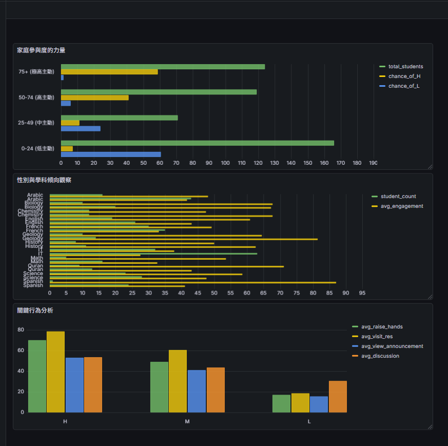

# 🎓 學生學術表現分析專案 (Education Data Analysis)

這是一個基於 Kaggle 資料集的教育數據分析專案，涵蓋了從環境建置、資料庫操作到數據可視化的完整流程。

[](https://www.kaggle.com/datasets/aljarah/xAPI-Edu-Data)
[](https://www.mysql.com/)

---

## 📊 數據可視化成果
透過分析學生的課堂參與度、家庭參與背景與學科傾向，我們產出了以下儀表板：



---

## 📂 目錄結構說明

為了維護專案的整潔與跨平台相容性，建議採用以下結構：

```text
├── education_mysql_code/     # MySQL 相關教育練習代碼
│   ├── code1
│   ├── code2
│   ├── code3
│   ├── code4
│   └── code5
│
├── env_problem/              # 環境建置相關可能會遇到的問題
│   └── python安裝網址
│
├── mysql/                    # MySQL 安裝與設置說明
│   ├── 流程一_mysql安裝完後設置
│   └── 流程二_mysql安裝完後設置
│
├── vscode安裝/               # VS Code 安裝指引
│   └── vdcode安裝網址
│ 
├── Python安裝/               # python 安裝指引
│   └── python安裝網址
│ 
├── grafana安裝/               # grafana 安裝
│   └── grafana安裝網址
└── README.md                 # 整個專案說明文件
```